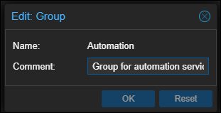
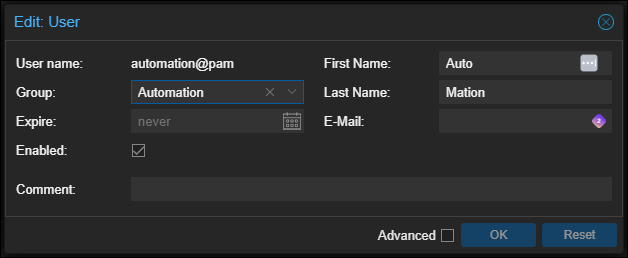
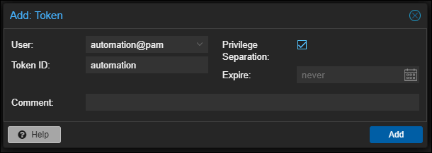
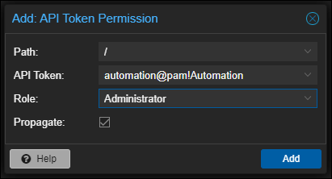

## Getting Started

This repository is built around the concept of standing-up several app servers in a [ProxMox](https://www.proxmox.com/en/proxmox-virtual-environment/overview) virtualization envinronment. This assumes you already have a ProxMox server where these machines can be hosted.

## Retrieving a ProxMox API Key

One of the things you will need is an API Key, or really it's a service account in ProxMox. Here are the basic steps you'll need to do this:

### STEP 1: Create a user group

We'll need this for creating a user, later. Navigate into the "Datacenter" level of navigation into the ProxMox web interface and choose Permissions, then Groups in the secondary navigation. Click "Add" to create a new user group:



### STEP 1: Create a user

Navigate into the "Datacenter" level of navigation in the ProxMox web interface and choose Permissions, then Users in the secondary navigation. Click "Add" to create a new user. I'm calling this one "automation":



### STEP 2: Create an API Token

Navigate into the Permissions, then API Tokens menu in the seconday navigation. Click "Add" to create a new API Token. That needs to be associated with a user:



### STEP 3: Assign permissions

Navigate into the Permissions level of the secondary navigation and click "Add", and then "API Token Permission". There is a user account `automation` with an API Key `automation`, and we're going to give that `Administrator` privilege for the whole `/` instance.



## Configuring Terraform

You might note in the [vars.tf](vars.tf) file this is expecting three environment variables:

1. `api_url`
1. `api_user`
1. `api_password`

### Variable: `api_url`

This is the URL to your ProxMox server's API endpoint. For example, you might set an environment variable in bash with:

```bash
export TF_VAR_api_url="https://proxmox.int.example.com:8006/api2/json"
```

> **NOTE:** for Terraform to read this environment variable, it does need the `TF_VAR_` prefix.

### Variable: `api_user`

For the username, this is the ProxMox username or API Token to use:

```bash
export TF_VAR_api_user="automation@pam"
```

### Variable: `api_password`

This is the ProxMox password for the username above.

```bash
export TF_VAR_api_password="ZwfT2j8hIE6pKQXj"
```

## Summary

With the ProxMox credentials in place, those are read-in via [vars.tf](vars.tf). The ProxMox "provider" (~~[telemate/proxmox](https://registry.terraform.io/providers/Telmate/proxmox/latest/docs)~~ [TheGameProfi/proxmox](https://registry.terraform.io/providers/TheGameProfi/proxmox/latest/docs)) is then fed the URL, username and password in [main.tf](main.tf). Finally, the machines we want to build are defined in [internal-machines.tf](internal-machines.tf).

This Terraform provisioning is really just going to take care of standing up the right virtual machines, based on the specified Cloud Images, naming them, and assigning the hardware (e.g. vCPU, RAM, etc). A later step via Ansible will take care of configuring it further.
